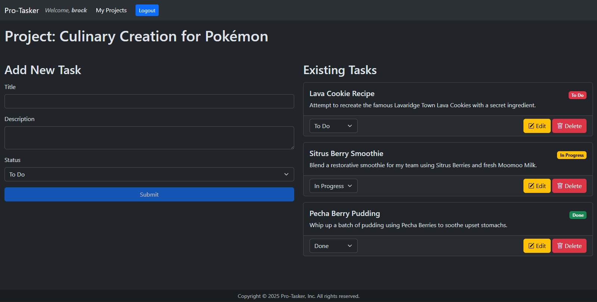

# Per Scholas Software Engineering Capstone Project: Front-End

[Karl Johnson](https://github.com/hirekarl)  
2025-RTT-30  
<time datetime="2025-09-12">2025-09-12</time>  



## Overview
### Description
[*Pro-Tasker*](https://hirekarl-ps-capstone.netlify.app) is a project and task management app built with a [React](https://react.dev/)/[Bootstrap](https://getbootstrap.com/) front-end and a back-end running on [Express.js](https://expressjs.com/), [Node.js](https://nodejs.org/), and a [MongoDB](https://www.mongodb.com/)/[Mongoose](https://mongoosejs.com/) database. It was created by [Karl Johnson](https://github.com/hirekarl) as a capstone project in fulfillment of [Per Scholas](https://perscholas.org/)' remote 2025-RTT-30 [Software Engineering](https://perscholas.org/courses/software-engineer/software-engineer-new-york/) cohort, which ran from <time datetime="2025-06">June</time> to <time datetime="2025-09">September 2025</time>.

#### API Documentation
[Full API documentation, including endpoints, usage, and expected server responses, is located here](https://github.com/hirekarl/capstone_backend/blob/main/README.md#api-documentation-version-1).

#### Proficiencies Demonstrated
This full-stack MERN application demonstrates proficiency in:
- **Front-end Development**
  - **React:** Building a dynamic user interface with components, managing state, and handling user interactions.
  - **HTML/CSS:** Structuring the content and styling the application for a good user experience.
  - **TypeScript (ES6+):** Writing the client-side logic, including asynchronous operations and modern syntax.
  - **Client-side Routing:** Managing navigation within the application without full page reloads.

- **Back-end Development**
  - **Node.js:** Creating a server-side runtime environment for the application.
  - **Express.js:** Building a RESTful API with routes to handle HTTP requests (GET, POST, PUT/PATCH, DELETE).
  - **RESTful APIs:** Designing and implementing an API that allows the front-end to communicate with the back-end.
  - **Authentication & Authorization:** Implementing user sign-up, login, and protected routes to secure the application.

- **Database Design & Implementation**
  - **MongoDB:** Setting up and managing a NoSQL database to store application data.
  - **Mongoose:** Using a object data modeling (ODM) library to interact with the MongoDB database from Node.js, including defining schemas and performing CRUD (Create, Read, Update, Delete) operations.

- **Full-Stack Integration**
  - **API Integration:** Connecting the front-end React application to the back-end Express API to fetch and post data.
  - **Version Control:** Using Git and GitHub to manage the project's codebase, track changes, and collaborate.
  - **Deployment:** Deploying the full-stack application to a hosting service ([Render](https://render.com/) for back-end, [Netlify](https://www.netlify.com/) for front-end).

#### Features
- **User Authentication & Authorization**
  - **User Authentication:** Enabled secure user registration and login to provide a personalized experience.
  - **Secure Routing:** Implemented Express middleware to protect routes, ensuring that only authenticated users can access project and task data.
  - **State Management:** Utilized JSON Web Tokens (JWTs), stored in the browser, to manage user sessions and maintain login state.

- **Project Management**
  - **Project Creation:** Allows users to create new projects and organize their work.
  - **Project **CRUD** Operations:** Provides a full set of functionalities to create, view, edit, and delete projects from the database.
  - **Intuitive UI:** Designed a single-page application (SPA) with React and Bootstrap to enable seamless viewing and management of projects without page reloads.

- **Task Management**
  - **Task Association:** Enabled the creation of tasks that are directly linked to specific projects.
  - **Task **CRUD** Operations:** Offers complete functionality to create, view, edit, and delete tasks within their corresponding projects.
  - **Data Persistence:** Ensured all project and task data is securely stored in a MongoDB database.

---

## Using & Evaluating the Application
### Viewer Instructions
To view and use the deployed application:
1. Navigate in the browser to https://hirekarl-ps-capstone.netlify.app.
2. Register for an account with a username, email, and password. (**NB:** *Please be patient! The back-end server needs time to spin up.*)
3. Create and manage projects and tasks.

### Submission Source
To view source code, navigate to the following URLs:
- Front-end: https://github.com/hirekarl/capstone_frontend (deployed at https://hirekarl-ps-capstone.netlify.app)
- Back-end: https://github.com/hirekarl/capstone_backend (deployed at https://capstone-backend-byjq.onrender.com)

---

## Installing & Running the Application Locally
### Before Beginning
Ensure you have:
- a [MongoDB Atlas](https://www.mongodb.com/cloud/atlas/register) account,
- a database cluster set up on MongoDB Atlas ([see this page for instructions on setting up a cluster on the free tier](https://www.mongodb.com/docs/atlas/tutorial/deploy-free-tier-cluster/)), and
- a connection string pointing to your MongoDB Atlas cluster ([see this page for instructions on getting your connection string](https://www.mongodb.com/docs/guides/atlas/connection-string/)).

### Installation
1. In the terminal, from a directory of your choice, run:

```bash
mkdir hirekarl_capstone && cd hirekarl_capstone
git clone https://github.com/hirekarl/capstone_backend.git
cd capstone_backend && npm install && cd ..
git clone https://github.com/hirekarl/capstone_frontend.git
cd capstone_frontend && npm install && cd ..
```

2. In the `hirekarl_capstone/capstone_backend/` directory, create an `.env` file with the following content, replacing the `MONGO_URI` value with the connection string to your MongoDB Atlas cluster, and replacing the `JWT_SECRET` value with a unique string generated from, for example, [JWTSecrets.com](https://jwtsecrets.com/):

```bash
PORT=3001
MONGO_URI=mongodb+srv://<username>:<password>@<cluster_name>/<database_name>?retryWrites=true&w=majority
JWT_SECRET=<SECRET_JWT_KEY>
CLIENT_ORIGIN=http://localhost:5173
```

3. In the `hirekarl_capstone/capstone_frontend/` directory, create an `.env` file with the following content:

```bash
VITE_ENDPOINT_BASE_URL=http://localhost:3001/api/v1
```

### Running the Application
Be sure any running VPNs are disconnected.

1. From a terminal instance, navigate to the `hirekarl_capstone/capstone_backend` directory and run `npm run dev`.

On successful back-end server start, the following will appear in the console:

```bash
Connected to database.
Server running on port 3001.
```

Leave the terminal instance running.

2. From a separate terminal instance, navigate to the `hirekarl_capstone/capstone_frontend` directory and run `npm run dev`.

On successfull front-end server start, a message from [Vite](https://vite.dev/) will appear in the console with a URL to http://localhost:3001.

3. Navigate to http://localhost:3001 in the browser.
4. Enjoy!

---

## Hire Me


In the market for a full-stack software engineer? <a href="mailto:hirekarl@proton.me?subject=Let%27s%20connect%21">Drop me an email</a>&mdash;I'd love to speak to you!

You can also find me [on LinkedIn](https://www.linkedin.com/in/hirekarl/) and, soon, [on the web](https://www.fullstackkarl.com) (*currently under construction*).
